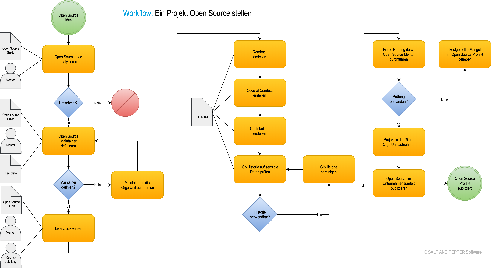

# Table of Contents

- [How to work with Open Source](#how-to-work-with-open-source)
  * [Mitarbeit in Open Source Projekten](#mitarbeit-in-open-source-projekten)
    + [Einen Beitrag einreichen](#einen-beitrag-einreichen)
  * [Ein eigenes Projekt Open Source stellen](#ein-eigenes-projekt-open-source-stellen)
    + [Was für Software eignet sich für Open Source?](#was-für-software-eignet-sich-für-open-source)
      - [Vierstufiger Ansatz](#vierstufiger-ansatz)
      - [Stelle folgendes niemals Open Source](#stelle-folgendes-niemals-open-source)
    + [Template für ein neues Open Source Projekt (Quickstart)](#template-für-ein-neues-open-source-projekt-quickstart)
      - [Prelaunch-Checkliste](#prelaunch-checkliste)
      - [README](#readme)
      - [CONTRIBUTING](#contributing)
      - [CODE_OF_CONDUCT](#code_of_conduct)
      - [LICENSE](#license)
    + [Projekt Basics](#projekt-basics)
  * [Workflow: Ein Projekt Open Source stellen](#workflow-ein-projekt-open-source-stellen)
    + [Wer ist Open Source Mentor?](#wer-ist-open-source-mentor)
- [Überblick Software- und andere Lizenzen](#uberblick-software--und-andere-lizenzen)
  * [Grundbegriffe](#grundbegriffe)
    + [Urheberrecht](#urheberrecht)
    + [Open Source](#open-source)
    + [Rechte vs. Pflichten](#rechte-vs-pflichten)
    + [Andere Lizenzmodelle](#andere-lizenzmodelle)
    + [Copyleft](#copyleft)
    + [Freizügige Lizenz](#permissive)
    + [Freie Software (Free Software)](#freie-software)
    + [Dual-Licensing](#dual-licensing)
    + [Lizenzkompatibilität](#lizenzkompatibilitat)
  * [Lizenzen für Software](#lizenzen-für-software)
    + [MIT](#mit)
    + [BSD](#bsd)
    + [Apache 2.0](#apache-20)
    + [GPL](#gpl)
    + [LGPL 2.1 und 3.0](#lgpl-21-und-30)
    + [Mozilla Public License (MPL)](#mozilla-public-license-mpl)
  * [Lizenzen für Daten/Medien](#lizenzen-für-datenmedien)
    + [Public Domain](#public-domain)
    + [GNU Free Documentation License](#gnu-free-documentation-license)
    + [Creative Commons](#creative-commons)
  * [License Selector](#license-selector)
- [Quellen](#quellen)

# How to work with Open Source

## Mitarbeit in Open Source Projekten

Die Mitarbeit an einem bestehenden Projekt besteht nicht zwangsläufig direkt aus dem Hinzufügen eines großen
neuen Features. Auch beim Melden eines Bugs oder Korrigieren eines Typos in der Projektdokumentation arbeitest
du am Projekt mit.

Die folgenden Absätze sollen dir Hilfestellung geben, damit deine Beiträge positiv vom Maintainer angenommen
werden.

### Einen Beitrag einreichen

Egal ob du einmalig mitarbeitest oder versuchst, der Community beizutreten: Die Mitarbeit mit anderen ist eine
der wichtigsten Fähigkeiten, die du bei der Arbeit an Open Source Projekten entwickelst. Behalte aber die
folgenden Hinweise im Hinterkopf, bevor du einen Bug einreichst, einen Pull-Request stellst oder eine Frage im
Chat stellst, damit deine Ideen gut aufgenommen werden.

**Kontext geben.** Unterstütze dein Gegenüber dabei, dich zu verstehen. Wenn du einen Fehler feststellst, dann
erläutere, was du machen möchtest und wie der Fehler zu reproduzieren ist. Erkläre, warum eine neue Idee, die
du vorschlägst, für das ganze Projekt gut ist - und nicht nur für dich.

**Mach deine Hausaufgaben.** Es ist OK, nicht alles zu wissen, aber versuche es vorher wenigstens. Lies die
README, die Projektdokumentation, gemeldete Bugs (geöffnete und geschlossene), Mailing Listen und Suche im
Netz nach Antworten, bevor du eine Frage stellst. Dein Gegenüber wird es zu schätzen wissen, wenn du versuchst
zu lernen.

**Halte Anfragen kurz und direkt.** Sei präzise. Egal wie klein oder hilfreich dein Beitrag auch ist, jemand
anders muss deine Anfrage bearbeiten. Einige Projekte haben sehr viele Anfragen für nur wenige Helfer und du
erhöhst die Wahrscheinlichkeit, dass dir geholfen wird, wenn du dich kurz fasst.

**Halte alle Kommunikation öffentlich.** Schreibe Maintainer nicht direkt an, wenn du nicht gerade sensible
Informationen (etwa einen sicherheitskritischen Bug oder eine Beschwerde über ein anderes Projektmitglied)
weitergeben willst – auch wenn es verlockend wirkt. Andere Nutzer können von der Konversation lernen, wenn du
den Austausch öffentlich hältst. Diskussionen z.B. über neue Feature können bereits Projektbeteiligungen sein.

**Es ist OK Fragen zu stellen (aber sei geduldig!).** Zu einem gewissen Zeitpunkt war jeder im Projekt mal neu
und selbst erfahrene Beitragende brauchen etwas Zeit, um in einem neuen Projekt effizient mitarbeiten zu
können. Genauso sind auch bereits lange Zeit Mitarbeitende nicht mit jedem Teil des Projekts vertraut: Bringe
ihnen gegenüber die gleiche Geduld auf, die du von ihnen erwarten würdest.

**Respektiere Entscheidungen der Gemeinschaft.** Deine Ideen weichen womöglich von den Prioritäten oder der
Vision der Community ab. Vielleicht geben sie dir Feedback oder entscheiden, die Idee nicht weiter zu
verfolgen. Du solltest schon diskutieren und Kompromisse eingehen, aber bedenke, dass die Maintainer
vermutlich länger als du mit der Entscheidung leben müssen. Solltest du mit der Projektausrichtung nicht
einverstanden sein, kannst du immer noch auf deinem eigenen Fork arbeiten oder ein neues, eigenes Projekt
starten.

<!-- TODO: Wollen wir wirklich so offen vorschlagen, dass du forkst oder ein neues Projekt startest? -->

**Vor allem: Bleib locker.** Open Source besteht aus Mitarbeitern aus der ganzen Welt. Zwischen Sprachen,
Kulturen, geografischen Grenzen und Zeitzonen geht oft der Kontext verloren. Zusätzlich ist es schwer eine
Emotion oder Gemütslage in geschriebener Kommunikation zu transportieren. Nimm immer die besten Absichten in
Gesprächen an. Es ist OK eine Idee höflich abzuweisen, nach mehr Kontext zu fragen oder um weitere Erklärung
der eigenen Position zu bitten. Versuche das Internet besser zu hinterlassen als du es vorgefunden hast.

## Ein eigenes Projekt Open Source stellen

### Was für Software eignet sich für Open Source?

#### Vierstufiger Ansatz

Angelehnt an den [four question approach](#four-stage-approach) von
[Danese Cooper](https://twitter.com/DivaDanese) und [Duane O'Brien](https://twitter.com/DuaneOBrien) sollte
man sich folgende 4 Fragen stellen:

##### Wen interessiert das?

Gibt es jemanden außerhalb von SALT AND PEPPER, der einen Nutzen daraus ziehen würde, dieses Projekt zu
benutzen? Nichts gelingt in Open Source ohne Beteiligung der Community und wenn es kein Interesse von außen
gibt, stehen die Chancen schlecht, dass es ein Erfolg wird.

##### Verwenden wir es selbst immer noch?

Wenn wir die Software nicht mehr aktiv entwickeln, ist es unwahrscheinlich, dass wir in der Lage sind die
Aufgaben auszuführen, die zur Aufrechterhaltung des Projekts oder zum Aufbau einer Community erforderlich
sind. Aufgaben wie behandeln von Bug- und Pull-Requests benötigen Zeit und es ist unwahrscheinlich, dass ein
Unternehmen Zeit in die Pflege von Software investiert, die nicht mehr verwendet wird.

##### Fühlen wir uns dazu verpflichtet?

Wie bereits erwähnt, braucht die Pflege eines Open Source Projekts Zeit. Manche Projekte brauchen sogar einen
Vollzeitmitarbeiter. Es ist deswegen wichtig, dass die Entwickler und ihre Manager hier auf derselben Seite
stehen und den Entwicklern für die Pflege genügend Zeit eingeräumt wird.

##### Kann das Projekt überhaupt öffentlich entwickelt werden?

Gibt es irgendetwas an dem Code, das uns daran hindern würde, diesen vollständig in der Öffentlichkeit zu
entwickeln? Wenn der Code aufgrund der Abhängigkeit von internen Systemen nicht öffentlich entwickelt werden
kann, müssen die Abhängigkeiten isoliert, abstrahiert oder modularisiert werden. Wenn nach diesem Prozess
nicht genügend Software übrig ist, um für die externe Welt von Wert zu sein, sollte man versuchen die internen
Abhängigkeiten freizugeben, die das Projekt nützlich gemacht haben. Wenn es immer noch nicht genug gibt, um zu
veröffentlichen, gibt es keinen Grund weiterzumachen.

#### Stelle folgendes niemals Open Source

* SALT AND PEPPER spezifische Projekte, die ganz eng mit den internen Systemen verzahnt sind
* Projekte, die man nicht plant zu maintainen (pflegen)
* Kundendaten
* Unique Selling Points (USPs)
* Alles, was unseren Wettbewerbsvorteil gefährden würde

Bitte denke immer dran, dass wenn man sensible Informationen veröffentlicht, können diese auch später aus der
git-Historie extrahiert werden.

### Template für ein neues Open Source Projekt (Quickstart)

Wenn Du Teil eines Unternehmens bist, das ein Projekt veröffentlicht, sorge bitte dafür, dass das Projekt über
alle internen Ressourcen verfügt, die es braucht um erfolgreich zu sein. Man sollte ermitteln, wer nach dem
Start für die Verwaltung des Projekts verantwortlich ist und wie diese Aufgaben mit der Community geteilt
werden.

Unabhängig davon in welchem Stadium man das Projekt veröffentlichen möchte, sollte jedes Projekt die folgende
Dokumentation enthalten:

* Open Source Lizenz
* README-Datei
* Contributing Guidelines
* Code of Conduct

Einem Maintainer helfen diese Komponenten die Erwartungen zu kommunizieren, Beiträge zu verwalten und die
gesetzlichen Rechte (einschließlich ihrer eigenen) zu schützen.

Außerdem muss, wenn ein Open Source Projekt gestartet wird, eine Lizenz hinzugefügt werden – sonst handelt es
sich nicht um Open Source.

#### Prelaunch-Checkliste

https://opensource.guide/starting-a-project/#your-pre-launch-checklist

#### README

README-Dateien erklären nicht nur wie man das Projekt verwendet, sondern auch warum das Projekt wichtig ist
und was die Benutzer damit machen können. Eine gute README-Datei versucht folgende Fragen zu beantworten:

* Was macht dieses Projekt?
* Warum ist dieses Projekt nützlich?
* Wie fange ich an?
* Wo kann ich mehr Hilfe bekommen, wenn ich sie brauche?

Man kann die README aber auch dafür verwenden, um weitere Fragen zu beantworten, z. B. wie man mit Beiträgen
anderer umgeht und was die Ziele des Projekts sind. Außerdem sollte der Lizenztexte sowie die Informationen
zur CONTRIBUTING Datei in der README verlinkt werden.

##### Templates für eine README

* [Zalando's README Template](https://github.com/zalando/zalando-howto-open-source/blob/master/READMEtemplate.md) -
  Einfache Vorlage, mit der man alle Grundlagen abdecken kann.
* [Standard Readme](https://github.com/RichardLitt/standard-readme) - Eine Standard-Readme-Spezifikation. Hat
  einen Generator zur Erstellung spezifikationskonformer READMEs.

#### CONTRIBUTING

In der CONTRIBUTING-Datei sollst du zeigen, wie Nutzer einen Beitrag zu dem Projekt leisten können. Hier
kannst du erläutern, welche Arten von Beiträgen gewünscht sind und wie der generelle Ablauf eines Beitrags
funktioniert. Beispielsweise können hier folgende Fragen beantwortet werden:

* Wie reiche ich einen Fehlerbericht ein?
* Wie schlage ich ein neues Feature vor?
* Wie richte ich die Entwicklungsumgebung ein und wie führe ich Tests aus?

Zusätzlich zu technischen Details bietet sich hier die Möglichkeit, die Erwartungen an Beiträge zu
kommunizieren, z.B.:

* Welche Arten von Beiträge werden gesucht
* Roadmap oder Vision des Projektes
* Wie Mitwirkende mit dir in Kontakt treten können (oder, dass kein Kontakt gewünscht ist)

In den ersten Phasen des Projekts kann die CONTRIBUTING-Datei einfach sein. Du solltest immer erklären, wie
Fehler gemeldet werden können und welche technischen Anforderungen (z. B. Tests) erforderlich sind, um einen
Beitrag zu leisten.

Mit der Zeit kannst du häufig gestellte Fragen hinzufügen. Wenn du diese Informationen hinterlegst, werden
immer weniger Menschen dieselben Fragen immer wieder stellen.

Außerdem ist es gut einen Link in der README zur CONTRIBUTING-Datei zu erstellen, damit mehr Leute sie sehen.

Generell hilft es eine freundliche Einleitung zu verwenden und spezifische Vorschläge für Beiträge (wie das
Schreiben von Dokumentation oder das Erstellen einer Website) zu machen, was dazu führt, dass sich Neulinge
willkommen fühlen und einen leichteren Einstieg in das Projekt finden.

##### Templates für eine CONTRIBUTING

* [Sehr ausführliches Template zum Erstellen einer CONTRIBUTING von Nadia Eghbal](https://github.com/nayafia/contributing-template/blob/master/CONTRIBUTING-template.md)
* [Mozilla Science Lab: Wrangling Web Contributions: How to Build a CONTRIBUTING.md](http://mozillascience.github.io/working-open-workshop/contributing/)

#### CODE_OF_CONDUCT

Mit einer CODE*OF_CONDUCT-Datei legst du einen Verhaltenscodex, und damit ein paar grundlegende Regeln fest,
wie sich am Projekt Beteiligte verhalten sollen. Dies ist vor allem für uns als Unternehmen ganz wichtig,
damit alle Maintainer ein gleiches Verständnis für die Art und Weise haben, wie im Projekt miteinander
umgegangen werden soll. Für uns ist vieles zwar spätestens mit der Betriebsvereinbarung beim Unterschreiben
des Arbeitsvertrages bei _SALT AND PEPPER* klar, aber sollte dennoch festgehalten werden. Zuletzt deswegen,
weil an einem Open Source Projekt auch irgendwann einmal Externe mitarbeiten sollen, die unsere
Unternehmenskultur nicht kennen.

Mit dem Codex kann eine Atmosphäre geschaffen werden, in der die Community rund um das Open Source Projekt
konstruktiv zusammenarbeiten kann und durch einen positiven Umgang dem Maintainer eine Menge Stress ersparen
kann.

Die folgenden Fragen solltest du mit einer CODE_OF_CONDUCT-Datei beantworten:

* Wie wünschst du dir den generellen Umgang zwischen Projektbeteiligten?
* Wie wünschst du dir Diskussionen rund um ein Thema zum Beispiel zu Feature-Requests oder Bugreports?
* Wie geht das Projekt mit Personen um, die gegen den Verhaltenscodex verstoßen?

Der Verhaltenscodex soll dafür sorgen, dass Projektbeteiligte konstruktiv miteinander arbeiten können. Als
Maintainer ist es entsprechend wichtig, auf Verstöße und Beschwerden zu reagieren. Weise bei Verstößen auf den
Verhaltenscodex hin und beschreibe, was nicht geht bzw. du dir anders vorstellst. Und sei bereit, die
Konsequenzen zu ziehen und einen Rüpel im Zweifel bei wiederholtem Verstoß vom Projekt auszuschließen.

##### Templates für ein CODE_OF_CONDUCT

* [Contributor Covenant Code of Conduct](https://www.contributor-covenant.org/) - Häufig eingesetzte Vorlage
  inkl. Generator Tool `covgen`
* [Citizen Code of Conduct](https://github.com/stumpsyn/policies/blob/master/citizen_code_of_conduct.md) -
  Vorlage, die neben Projekten auch für User Groups und Events verwendet werden kann

#### LICENSE

Nach Definition muss jedes Open Source Projekt eine Open Source Lizenz aufweisen. Wenn das Projekt keine
Lizenz aufweist, dann ist es nicht Open Source!

In der Regel befindet sich die Lizenz in einer LICENSE-Datei direkt im Repository, manchmal auch in der
README.

##### Welche Open Source Lizenz passt zu meinem Projekt?

Wenn du auf der grünen Wiese anfängst, dann kannst du mit der MIT-Lizenz im Grunde nicht falsch liegen. Sie
ist kurz, einfach zu verstehen und erlaubt so ziemlich jedem alles zu tun, so lange eine Kopie der Lizenz
inklusive Copyrighthinweis erhalten bleibt. Du hast jederzeit die Möglichkeit, das Projekt unter einer anderen
Lizenz zu veröffentlichen, sobald der Fall einmal eintritt.

[Ausführliche Informationen zu den einzelnen Lizenzen]()

### Projekt Basics

#### Documentation

GitHub's 2017 Open Source Survey stellte fest, dass unvollständige oder konfuse Dokumentationen das größte
Problem für Open Source Nutzer darstellen. Um daher eine bessere Interaktion mit der Community zu
gewährleisten ist eine gute Dokumentation unverzichtbar.

Startet ein Projekt neu, scheint es in erster Linie richtig zu sein die geleistete Arbeit intern zu halten.
Open Source Projekte leben jedoch davon den Entwicklungsprozess öffentlich zu dokumentieren. Die Community hat
dadurch die Möglichkeit an der Entstehung der Software mitzuarbeiten und Hilfestellung bei auftretenden Fragen
zu geben.

Unter der Dokumentation ist jedoch mehr zu verstehen als eine rein technische Dokumentation. Vielmehr sollte
die Community genutzt werden um Themen öffentlich zu diskutieren und eine Transparenz des Projektverlaufs zu
schaffen. Treten bei mehreren Nutzern dieselben Probleme auf ist es Ratsam diese in einer README festzuhalten.

#### GitHub Organization

Für SALT AND PEPPER ist eine GitHub Organization eingerichtet: https://github.com/SALT-AND-PEPPER/

Alle Open Source Projekte des Unternehmens werden unter dieser organisiert und geführt. Sprich einen der _Open
Source Mentoren_ an, um deinen GitHub Account mit aufzunehmen. Du darfst gern deinen privaten GitHub Account
verwenden.

## Workflow: Ein Projekt Open Source stellen

* Analyse
  * Projekt und Projektvision einem _Open Source Mentor_ vorstellen
  * Gibt es zukünftige Maintainer?
  * Grobes Prüfen der Lizenz (Erlaubnis im Projekt z.B. durch Kunden)
  * Hilfsmittel: Guide _How to work with Open Source_, _Open Source Mentor_
    * Ganz wichtig ist dabei der Abschnitt _Stelle folgendes niemals Open Source_!
* Maintainer benennen
  * zukünftige Maintainer des Projekts benennen
  * zukünftige Maintainer des Projekts sind Mitglied der _SALT AND PEPPER Organization bei GitHub_
  * Hilfsmittel: _Open Source Mentor_
* Lizenz auswählen
  * Hilfsmittel: Guide _Licenses_, _Open Source Mentor_
* Projekt vorbereiten
  * README
  * CONTRIBUTING
  * CODE_OF_CONDUCT
  * Hilfsmittel: Guide _How to work with Open Source_, _Open Source Mentor_
* Git Historie auf sensible Informationen prüfen
  * Commit Nachrichten säubern
  * Private Keys oder Zertifikate entfernen
  * Personenspezifische Daten entfernen
  * Im Zweifel: neues Projekt aufsetzen
  * Hilfsmittel: _Open Source Mentor_
* Freigabe durch _Open Source Mentor_
  * Prüfen des Projekts hinsichtlich Maintainer, Lizenz, Projektdokumentation, Git Historie
* Projekt veröffentlichen
  * Im Rahmen der _SALT AND PEPPER Organization_ bei GitHub veröffentlichen
  * Hilfsmittel: _Open Source Mentor_
* Veröffentlichung bekanntgeben
  * Status Meeting
  * Town Square

### Wer ist Open Source Mentor?

* Jeder aus der _Arbeitsgruppe Open Source_
* kennt die Open Source Guides und deren Idee
* hat ein Grundverständnis der verschiedenen Open Source Lizenzen und entsprechende Präferenzen

--------------------

# Überblick Software- und andere Lizenzen

## Grundbegriffe

### Urheberrecht

Das Urheberrecht ist das maßgebliche Schutzrecht für Software und deren Lizenzierung in *Deutschland*.

Spezifische Regelungen für Software finden sich in *§§ 69 a ff. UrhG*:

* Urheberrechtsschutz entsteht *automatisch* nach Fertigstellung der Software.
* Das Computerprogram muss ein „individuelles Werk“/„Ergebnis einer eigenen geistigen Schöpfung“ sein.

Der Ueheberrechtsschutz erstreckt sich nur auf die Ausdrucksform des Computerprogramms und nicht auf dessen Funktionalität.

* Geschützte Ausdrucksformen sind Maschinen-, Objekt- und Quellcode, sowie innere Struktur und Organisation des Computerprogramms.
* Ideen und Grundsätze, die dem Computerprogramm zugrunde liegen, sind nicht geschützt.

### Open Source

Jede Software steht automatisch nach deutschem Recht unter [Urheberrecht](#urheberrecht), um dem Autor der Software umfassende Rechte einzuräumen und sein geistiges Werk zu schützen. Beispielsweise betrifft dies das Recht zur Vervielfältigung, Bearbeitung und Verbreitung.

Open Source stellt eine bestimmte Art der Lizenzierung einer Software dar, bei der der Quellcode unter einer bestimmten Lizenz veröffentlicht wird und der Autor als Rechteinhaber der Software der Öffentlichkeit bestimmte Nutzungsrechte einräumt.

Nach der Open Source Initiative (OSI) müssen die Lizenzbedingungen von Open Source Software (OSS) dem *Lizenznehmer* (also jedem Nutzer der Software) urheberrechtliche Nutzungsrechte einräumen, die folgendes ermöglichen:

* das Ablaufenlassen der Software auf der eigenen Hardware
* Untersuchung der Software
* Vervielfältigung und Verbreitung der erstellten Kopien der Software
* Verbreitung der Software auf Hardware (z.B. Embedded Systeme)
* Zugänglichmachen der Software per Download
* Bearbeitete und veränderte Versionen der Software im Sourcecode weiterverbreiten
* in der Regel ist auch die Vermietung der Software (bspw. als SaaS) erlaubt

### Rechte vs. Pflichten

Neben Rechten stellen Open Source Lizenzen in der Regel auch bestimmte Pflichten an den *Lizenznehmer*, z.B. Copyleft, Mitlieferung von Lizenztexten, u.a. Hierin unterscheiden sich die verschiedenen Lizenzen stark.

### Andere Lizenzmodelle

Neben Open Source gibt es weitere Lizenzmöglichkeiten für Software:

#### Proprietäre Software (Closed Source)

Proprietäre Software (auch "closed source") als Gegenteil von Open-Source-Software räumt in den Lizenzbedingungen nicht alle nötigen Rechte ein, um der obigen Definition von "Open Source" zu genügen.

Wenn zu einem Stück Software keine expliziten Lizenzbedingungen mitgeliefert wurden, werden keine besonderen Nutzungsrechte eingeräumt - ohne Lizenzvermerk ist Software also **standardmäßig proprietär**.

#### Shareware

Proprietäre Software, bei der der Nutzer das Programm für eine gewisse Probezeit kostenlos benutzen darf.

#### Freeware

**Kostenfreie** Überlassung der Software. Der Nutzungsumfang kann vollkommen unterschiedlich sein.

#### Public Domain Software

Der Autor der Software verzichtet auf sein Urheberrecht mit der Folge, dass Software von jedermann ohne Restriktionen genutzt werden kann.

Dies ist eher relevant für die rechtliche Situation in den USA. In Deutschland ist ein kompletter Verzicht auf das Urheberrecht wegen der Urheberpersönlichkeitsrechte nicht möglich. Nach **deutschem Recht** wird dies ausgelegt als **Lizenz ohne Verpflichtung für den Lizenznehmer**.

### Copyleft

Copyleft-Lizenzen verpflichten den Lizenznehmer dazu, Bearbeitungen der Ursprungssoftware wieder unter denselben Bedingungen der Open-Source-Lizenz freizugeben. Bekannte Vertreter sind die [**GPL**-Lizenzen](#gpl). Dazu werden die Lizenzpflichten verwendet, um die Offenheit der Software zu erzwingen statt einzuschränken.

Abhängig von der Lizenz kann bei der *Bearbeitung* einer Open Source Software oder *Einbindung* von Codeteilen das sogenannte **Copyleft** greifen.
Bei Lizenzen ohne Copyleft steht es dem Lizenznehmer frei, seine Bearbeitungen der Ursprungssoftware wieder unter einer Open Source Lizenz zu verbreiten oder [proprietär](#proprietary) zu lizenzieren.

Im Abschnitt [Lizenzen für Software](#licenses) ist aufgeführt, welche Lizenzen eine Copyleft-Klausel enthalten.

Bei der Einbindung oder Bearbeitung von Open Source Software unter Copyleft-Lizenz sollte im Einzelfall geprüft werden, ob das **Copyleft** greifen könnte.

### Freizügige Lizenz

Freizügige (engl. _permissive_) Lizenzen ist eine andere Bezeichnung für Nicht-[Copyleft](#copyleft)-Lizenzen. Auch als BSD-Style-Lizenzen bekannt.

### Freie Software (Free Software)

Nicht zu verwechseln mit [Freeware](#freeware).

Freie Software ist laut [Definition der Free Software Foundation (FSF)](https://www.gnu.org/philosophy/free-sw.en.html) solche, die den Nutzern fünf grundlegende Freiheiten erlaubt. In der Praxis liegt diese Definition [sehr nah](https://www.gnu.org/philosophy/categories.html) an der [Open Source](#open_source)-Definition.

### Dual-Licensing

Software kann unter mehrere Lizenzen gestellt werden, insbesondere unter eine "Closed Source" und eine "Open Source"-Lizenz. Dual-Licensing ist nur möglich, wenn die Lizenz keine strenge Copyleft-Klausel enthält.

### Lizenzkompatibilität

Sollen verschiedene Softwaremodule, die unter verschiedenen Open Source Lizenzen stehen, zu einem neuen Programm verbunden werden oder Codebestandteile aus einem Open Source Projekt in einem andere Open Source Projekt verwendet werden, ist die Lizenzkompatibilität zu prüfen.

Wird Software mit verschiedenen Copyleft-Lizenzen verwendet kann es grundsätzlich zu Problemen führen, unter welcher Lizenz die abgeleitete Software steht. Weitere Informationen dazu finden sich unter <https://en.wikipedia.org/wiki/License_compatibility>.

## Lizenzen für Software

Die folgenden Beschreibungen sollen einen Überblick vermitteln über die Landschaft der Open-Source-Lizenzen. Sie sind nicht unbedingt erschöpfend oder korrekt.

Zum genaueren Nachlesen gibt es jeweils einen Link zum Lizenztext und einen Link auf den Eintrag zur jeweiligen Lizenz auf GitHubs https://choosealicense.com.

### MIT

Die MIT Lizenz ist eine simple und freizügige Lizenz. Diese erfordert lediglich, dass der Copyright und Lizenztext mit übernommen wird. Sie ist mit vielen Lizenzen kompatibel und kann bei Modifikationen und größeren Änderungen frei unter eigener Lizenz verteilt werden.

| | [MIT](https://choosealicense.com/licenses/mit/) |
| --- | --- |
| Copyleft | Nein |
| Besonderheiten | kurzer Lizenztext, beliebteste Lizenz auf GitHub (Nov 2017)|
| Eigene Software darf weiterverbreitet werden | Ja |
| Eigene Software muss Open-Source sein | Nein |
| Eigene Software muss unter dieselbe Lizenz gestellt werden | Nein |
| Änderungen am lizenzierten Werk müssen explizit genannt werden | Nein |
| Änderungen am lizenzierten Werk müssen offen gestellt werden | Nein |
| Ursprüngliche Lizenz muss mit ausgeliefert werden | Ja |
| Ursprünglicher Rechteinhaber muss genannt werden | Ja |
| Lizenztext | https://opensource.org/licenses/MIT |
| bekannte Vertreter ([GitHub](https://github.com/search?l=&o=desc&q=stars%3A%3E1000+license%3Amit&ref=advsearch&s=stars&type=Repositories&utf8=%E2%9C%93)) | Node.js, jQuery, .NET Core, Ruby on Rails |

### BSD

Die BSD-Lizenzen sind, ähnlich der MIT-Lizenz, eine Gruppe von freizügigen Lizenzen, die ursprünglich von der University of California, Berkeley stammen.

Die ursprüngliche BSD-Lizenz enthielt 4 Klauseln, die "neue" 3-Klausel-Variante entfernt die Werbeklausel, die verlangt, den Namen der Universität oder anderer Beitragender zu nennen.

Mit der 2-Klausel-Variante, auch FreeBSD-Lizenz genannt, entfällt zusätzlich noch der Absatz, der es anderen ohne schriftliche Zustimmung untersagt, den Namen des Urhebers oder ihrer Mitwirkenden zu verwenden, um abgeleitete Produkte zu fördern.

Weitere Varianten sind ebenfalls in Benutzung, unter anderem die ["3-clause clear"-Lizenz](https://choosealicense.com/licenses/bsd-3-clause-clear/), die eine explizite Klausel zum Patentausschluss enthält.

Am verbreitetsten ist [laut GitHub](https://github.com/blog/1964-license-usage-on-github-com) die ["BSD 3-clause"](https://choosealicense.com/licenses/bsd-3-clause/)-Lizenz, gefolgt von der ["BSD 2-clause"](https://choosealicense.com/licenses/bsd-2-clause/).

| | [BSD 3-clause](https://choosealicense.com/licenses/bsd-3-clause/) |
| --- | --- |
| Copyleft | Nein |
| Besonderheiten | |
| Eigene Software darf weiterverbreitet werden | Ja |
| Eigene Software muss Open-Source sein | Nein |
| Eigene Software muss unter dieselbe Lizenz gestellt werden | Nein |
| Änderungen am lizenzierten Werk müssen explizit genannt werden | Nein |
| Änderungen am lizenzierten Werk müssen offen gestellt werden | Nein |
| Ursprüngliche Lizenz muss mit ausgeliefert werden | Ja |
| Ursprünglicher Rechteinhaber muss genannt werden | Ja |
| Lizenztext | https://opensource.org/licenses/BSD-3-Clause  |
| bekannte Vertreter ([GitHub](https://github.com/search?l=&o=desc&q=stars%3A%3E1000+license%3Absd-3-clause&ref=advsearch&s=stars&type=Repositories&utf8=%E2%9C%93)) | d3, React Native, Go (Programmiersprache) |

### Apache 2.0

Apache 2.0 ist eine freizügige Lizenz, deren Hauptbedingungen die Aufrechterhaltung von Urheberrechts- und Lizenzvermerken erfordern. Es wird eine ausdrückliche Patentlizenz gewährt. Eigene Werke, Modifikationen und größere Projekte basierend auf Apache 2.0 können unter verschiedenen Bedingungen und ohne Quellcode verteilt werden. Erteilt explizit _keine Erlaubnis_ zur Nutzung von Marken des Lizenzgebers.

| | [Apache 2.0](https://choosealicense.com/licenses/apache-2.0/) |
| --- | --- |
| Copyleft | Nein |
| Besonderheiten | Explizite Gewährung einer Patentlizenz |
| Eigene Software darf weiterverbreitet werden | Ja |
| Eigene Software muss Open-Source sein | Nein |
| Eigene Software muss unter dieselbe Lizenz gestellt werden | Nein |
| Änderungen am lizenzierten Werk müssen explizit genannt werden | Ja |
| Änderungen am lizenzierten Werk müssen offen gestellt werden | Nein |
| Ursprüngliche Lizenz muss mit ausgeliefert werden | Ja |
| Ursprünglicher Rechteinhaber muss genannt werden | Ja |
| Lizenztext | https://www.apache.org/licenses/LICENSE-2.0 |
| bekannte Vertreter ([GitHub](https://github.com/search?l=&o=desc&q=stars%3A%3E1000+license%3Aapache-2.0&ref=advsearch&s=stars&type=Repositories&utf8=%E2%9C%93)) | Apache, Android, Swift, tensorflow |

### GPL

[Beliebte Projekte auf GitHub](https://github.com/search?l=&o=desc&q=stars%3A%3E1000+license%3Agpl&ref=advsearch&s=stars&type=Repositories&utf8=%E2%9C%93)

#### Version 2

Die GNU GPL ist die am weitesten verbreitete Lizenz für freie Software und hat eine starke Copyleft-Anforderung. Bei der Verteilung von abgeleiteten Arbeiten muss der Quellcode der Arbeit unter derselben Lizenz verfügbar gemacht werden. Es gibt mehrere Varianten der GNU GPL mit jeweils unterschiedlichen Anforderungen. Die GPL v2.0 Variante gibt keine Auskunft über die Erteilung von Patentrechten.

| | [GPLv2](https://choosealicense.com/licenses/gpl-2.0/) |
| --- | --- |
| Copyleft | Stark |
| Besonderheiten | Nutzung in Patenten unklar |
| Eigene Software darf weiterverbreitet werden | Ja |
| Eigene Software muss Open-Source sein | Ja |
| Eigene Software muss unter dieselbe Lizenz gestellt werden | Ja |
| Änderungen am lizenzierten Werk müssen explizit genannt werden | Ja |
| Änderungen am lizenzierten Werk müssen offen gestellt werden | Ja |
| Ursprüngliche Lizenz muss mit ausgeliefert werden | Ja |
| Ursprünglicher Rechteinhaber muss genannt werden | Ja |
| Lizenztext | https://www.gnu.org/licenses/gpl-2.0.txt |
| bekannte Vertreter | Linux, BusyBox, Blender |

#### Version 3

Die Berechtigungen dieser starken Copyleft-Lizenz sind für kommerzielle Zwecke sehr eingeschränkt durch die Bedingungen. Es wird eine Bereitstellung des vollständigen Quellcodes für lizenzierte Werke und Änderungen, unter der GPL Lizenz, gefordert. Copyright- und Lizenzhinweise müssen erhalten bleiben. Diese Lizenz erteilt ausdrückliche das erstellen von Patentrechten.

| | [GPLv3](https://choosealicense.com/licenses/gpl-3.0/) |
| --- | --- |
| Copyleft | Stark |
| Besonderheiten | Nutzung in Patenten explizit erlaubt |
| Eigene Software darf weiterverbreitet werden | Ja |
| Eigene Software muss Open-Source sein | Ja |
| Eigene Software muss unter dieselbe Lizenz gestellt werden | Ja |
| Änderungen am lizenzierten Werk müssen explizit genannt werden | Ja |
| Änderungen am lizenzierten Werk müssen offen gestellt werden | Ja |
| Ursprüngliche Lizenz muss mit ausgeliefert werden | Ja |
| Ursprünglicher Rechteinhaber muss genannt werden | Ja |
| Lizenztext | https://www.gnu.org/licenses/gpl-3.0.txt |
| bekannte Vertreter | Bash, GIMP, uBlock Origin |

### LGPL 2.1 und 3.0

Die Berechtigungen dieser Copyleft-Lizenz sind abhängig von der verwendung der Lizenz. Sie erfordern die Bereitstellung des vollständigen Quellcodes des verwendeten Werkes und dessen Modifikationen unter derselben Lizenz oder der GNU GPLv3. Copyright- und Lizenzhinweise müssen erhalten bleiben. In der Version 3 wird ausdrückliche eine Erteilung von Patentrechten angegeben. Größere Werke bzw. Projekte, die die unter LGPL lizenzierten Quellcode über Schnittstellen verwendet bzw. als Bibliothek, können unter anderen Bedingungen und ohne Quellcodeherausgabe verteilt werden.

| | [LGPL 2.1](https://choosealicense.com/licenses/lgpl-2.1/) |
| --- | --- |
| Copyleft | Schwach |
| Besonderheiten | Copyleftausnahme für Linking |
| Eigene Software darf weiterverbreitet werden | Ja |
| Eigene Software muss Open-Source sein | Nur wenn Copyleft greift |
| Eigene Software muss unter dieselbe Lizenz gestellt werden | Nur wenn Copyleft greift |
| Änderungen am lizenzierten Werk müssen explizit genannt werden | Ja |
| Änderungen am lizenzierten Werk müssen offen gestellt werden | Nur wenn Copyleft greift |
| Ursprüngliche Lizenz muss mit ausgeliefert werden | Ja |
| Ursprünglicher Rechteinhaber muss genannt werden | Ja |
| Lizenztext | https://www.gnu.org/licenses/lgpl-2.1.txt |
| bekannte Vertreter ([GitHub](https://github.com/search?l=&o=desc&q=stars%3A%3E1000+license%3Algpl&ref=advsearch&s=stars&type=Repositories&utf8=%E2%9C%93)) | OpenOffice, Qt |

Copyleft-Lizenz

Rahmenbedingungen für die kommerzielle Nutzung von LGPL-Komponenten:
* Nutzung der Library in unveränderter Form
* Einbindung durch dynamische Verlinkung ("shared library")
* Möglichkeit zum Austausch der Library
* Beachtung von formalen Anforderungen und Hinweispflichten

Die LGPL stellt an die Nutzung von LGPL-Komponenten diverse formale Anforderungen und Hinweispflichten:

* Auf die Verwendung der LPGL-lizenzierten Komponente und die Anwendbarkeit der LGPL muss deutlich hingewiesen werden (z.B. in der Dokumentation).
* Wenn die Software während des Programmlaufs Copyright-Hinweise anzeigt, müssen auch die Copyright-Hinweise der LGPL-Komponente angezeigt werden. Ferner muß eine Bezugsquelle für die LGPL- und GPL-Lizenzen angezeigt werden, z.B. ein Link auf die FSF-Website.
* Die GPL und LGPL müssen der Software beigefügt werden.
* Es muss dokumentiert werden, wie ein Programmlauf mit einer modifizierten Version der LGPL-Library (s.o.) möglich ist.

Ab Version 3 der LGPL wird Code in Header und Inline berücksichtigt und gilt als Teil der Bibliothek und nicht als statisches Linken. Bis V3.0 sind nur 10 Zeilen pro Funktion oder Macro abgedeckt.

Kompatibel mit GPL.

### Mozilla Public License (MPL)

Die MPL ist eine schwache Copyleft-Lizenz. Diese erfordert, dass Quellcode-Dateien des verwendeten Werkes nur bei Änderung unter der gleichen Lizens verteilt und verfügbar gemacht werden soll. Copyright- und Lizenzhinweise müssen erhalten bleiben. Patentrechte können mit dieser Lizenz explizit erstellt werden.

| | [MPL](https://choosealicense.com/licenses/mpl-2.0/) |
| --- | --- |
| Copyleft | Schwach |
| Besonderheiten | Kompromiss zwischen der GPL und BSD Lizenz |
| Eigene Software darf weiterverbreitet werden | Ja |
| Eigene Software muss Open-Source sein | Nur wenn Copyleft greift |
| Eigene Software muss unter dieselbe Lizenz gestellt werden | Nur wenn Copyleft greift  |
| Änderungen am lizenzierten Werk müssen explizit genannt werden | Ja |
| Änderungen am lizenzierten Werk müssen offen gestellt werden | Ja |
| Ursprüngliche Lizenz muss mit ausgeliefert werden | Ja |
| Ursprünglicher Rechteinhaber muss genannt werden | Ja |
| Lizenztext | https://www.mozilla.org/media/MPL/2.0/index.txt |
| bekannte Vertreter ([GitHub](https://github.com/search?l=&o=desc&q=stars%3A%3E1000+license%3Ampl-2.0&ref=advsearch&s=stars&type=Repositories&utf8=%E2%9C%93)) | LibreOffice, Syncthing, Servo, TimelineJS3 |

## Lizenzen für Daten/Medien

### Public Domain

* auch für Non-Software eingesetzt
* siehe Abschnitt [Public Domain](#public_domain)

### GNU Free Documentation License

* GFDL, "GNU-Lizenz für freie Dokumentation"
* Gedacht als Lizenz für Software-Dokumentation
* Wird auch verwendet für andere freie Inhalte (engl. "free content", "open content"), z.B. die [Texte in der Wikipedia](https://de.wikipedia.org/w/index.php?title=GNU-Lizenz_f%C3%BCr_freie_Dokumentation&oldid=168143889)
* [vergleichbar mit CC-BY-SA](https://wiki.creativecommons.org/wiki/GFDL_versus_CC-by-sa), aber älter als Creative Commons (GFDL erschien 2000 in Version 1.1)
* gilt als kompliziert, es gibt keine Rechtsprechung im deutschen Rechtsraum (anders als z.B. GPL oder CC-Portierung)

### Creative Commons

Die [Creative Commons Organisation](https://creativecommons.org/) pflegt eine Suite von Lizenzen, die speziell für Nicht-Software-Inhalte wie Software-Dokumentation, Bilder, Musik und Video gedacht sind.

#### Namensnennung (CC BY)

Diese Lizenz erlaubt anderen, Ihr Werk zu verbreiten, zu remixen, zu verbessern und darauf aufzubauen, auch kommerziell, solange Sie als Urheber des Originals genannt werden. Dies ist die freieste Lizenz empfohlen für maximale Verbreitung und Nutzung des lizenzierten Werkes!

#### Namensnennung - Nicht kommerziell (CC BY-NC)

Diese Lizenz erlaubt es anderen, Ihr Werk zu verbreiten, zu remixen, zu verbessern und darauf aufzubauen, allerdings nur nicht-kommerziell. Und obwohl auch bei den auf Ihrem Werk basierenden neuen Werken Ihr Namen mit genannt werden muss und sie nur nicht-kommerziell verwendet werden dürfen, müssen diese neuen Werke nicht unter denselben Bedingungen lizenziert werden.

#### Namensnennung - Weitergabe unter gleichen Bedingungen (CC BY-SA)

Diese Lizenz erlaubt es anderen, Ihr Werk zu verbreiten, zu remixen, zu verbessern und darauf aufzubauen, auch kommerziell, solange Sie als Urheber des Originals genannt werden und die auf Ihrem Werk basierenden neuen Werke unter denselben Bedingungen veröffentlicht werden. Diese Lizenz wird oft mit "Copyleft"-Lizenzen im Bereich freier und Open Source Software verglichen. Alle neuen Werke, die auf Ihrem ursprünglichen Werk aufbauen, werden unter derselben Lizenz stehen, also auch kommerziell nutzbar sein. Dies ist die Lizenz, die auch von der Wikipedia eingesetzt wird, empfohlen für Werke, für die eine Einbindung von Wikipedia-Material oder anderen so lizenzierten Werken sinnvoll sein kann.

#### Namensnennung - Keine Bearbeitung (CC BY-ND)

Diese Lizenz erlaubt anderen die Weiterverbreitung Ihres Werkes, kommerziell wie nicht-kommerziell, solange dies ohne Veränderungen und vollständig geschieht und Sie als Urheber genannt werden.

#### Namensnennung - Nicht kommerziell - Weitergabe unter gleichen Bedingungen (CC BY-NC-SA)

Diese Lizenz erlaubt es anderen, Ihr Werk zu verbreiten, zu remixen, zu verbessern und darauf aufzubauen, allerdings nur nicht-kommerziell und solange Sie als Urheber des Originals genannt werden und die auf Ihrem Werk basierenden neuen Werke unter denselben Bedingungen veröffentlicht werden.

#### Namensnennung - Nicht kommerziell - Keine Bearbeitung (CC BY-NC-ND)

Dies ist die restriktivste unserer sechs Kernlizenzen. Sie erlaubt lediglich Download und Weiterverteilung des Werkes unter Nennung Ihres Namens, jedoch keinerlei Bearbeitung oder kommerzielle Nutzung.

## License Selector

* [GitHub License Selector](https://ufal.github.io/public-license-selector/)

# Quellen

* [Prof. Dr. Iris Kirchner-Freis, LL.M.Eur.](http://www.mls-legal.de); ([CC-BY-SA](https://creativecommons.org/licenses/by-sa/4.0/))
* https://wiki.creativecommons.org/wiki/GFDL_versus_CC-by-sa ([CC-BY](https://creativecommons.org/licenses/by/4.0/))
* [opensource.guide](https://opensource.guide/)
* [How to Open Source at Zalando](https://github.com/zalando/zalando-howto-open-source)
* https://github.com/blog/1964-license-usage-on-github-com (Lizenz?)
* https://choosealicense.com/appendix/ ([CC-BY](https://creativecommons.org/licenses/by/3.0/))
* https://www.it-economics.de/blog/2016-3/pt9oi6kzodgcl1tmsfc1yn1vzq4usb (Lizenz unklar)
* [Four Stage Approach](https://opensource.com/business/16/1/4-questions-ask-open-sourcing-project)
